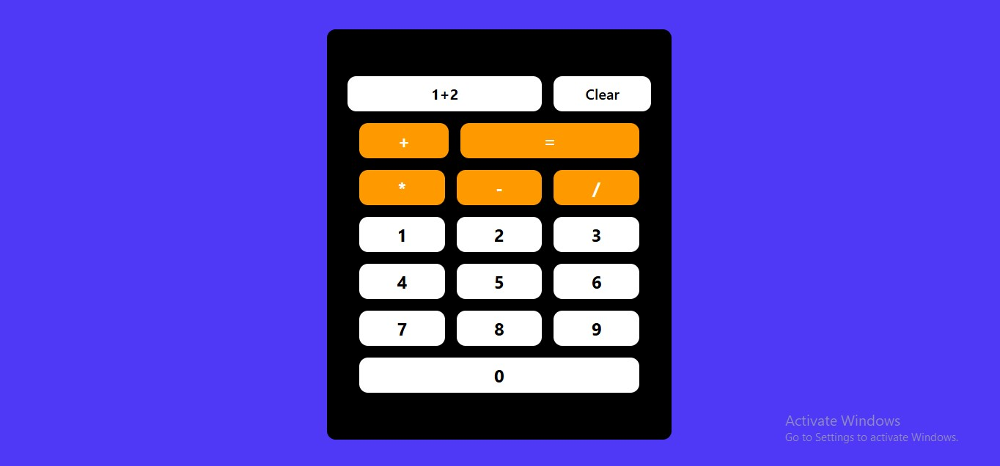

## Calculator using React
#### A simple yet fully responsive calculator app built using React and Tailwind CSS. This app leverages React's useState hook for state management and eval() function to evaluate mathematical expressions. The app is designed with a clean and intuitive UI, making it easy to use for basic calculations.
#### Features
- **Basic Arithmetic Operations:** Supports addition, subtraction, multiplication, and division.
- **Responsive Design:** Fully responsive layout, optimized for both desktop and mobile devices.
- **State Management:** Utilizes React's useState hook to manage user input and calculation results.
- **Eval Function:** Uses JavaScript's built-in eval() function to evaluate user input as mathematical expressions.
- **User-Friendly Interface:** Simple and easy-to-navigate interface designed with Tailwind CSS.

#### Output
*In Big Screen*

*In Small Screen*
   - 

   - [GitHub Respositary](https://github.com/Ambadi7/react-calculator.git)

   - [Live Demo](https://a-react-calculator.netlify.app/)